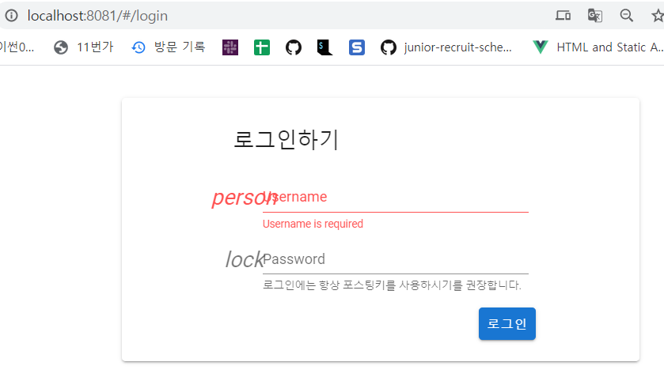

# front-end

## Project setup
```
npm install
```

### Compiles and hot-reloads for development
```
npm run serve
```

### Compiles and minifies for production
```
npm run build
```

### Lints and fixes files
```
npm run lint
```

### Customize configuration
See [Configuration Reference](https://cli.vuejs.org/config/).

## 컴포넌트 구조


## 기능 구현

> 각 기능을 구현하면서 마주쳤던 에러, 해결법을 정리해주세요 !  :pencil2:

### 1. UI / UX 디자인

### 2. header

### 3. 로그인

> 회원가입은 기능에서 제외(04/14)

#### 3-1. Vue.js + Vuex - Registration and Login 

[참고 링크](https://jasonwatmore.com/post/2018/07/14/vue-vuex-user-registration-and-login-tutorial-example#registerpage-vue) 

> Vue.js, Vuex 를 이용한 기본 로그인, 회원가입 기능 구현

#### 3-2. <del>스팀잇(Steemit)기반</del> 로그인 기능 구현

> 로그인 기능 구현에만 의의를 둘 것! 스팀잇 서버 사용 안할 것임!

[참고 링크](https://busy.org/@anpigon/steemit-6)

> Vuex 를 사용한 로그인 기능 구현
>
> Vuex의 저장소(store) : 애플리케이션의 상태를 저장하고 있음

* Vuex 설치

  ```bash
  $ npm install vuex --save 
  ```

* 파일 구조

  ```
  src
  ├── components
  │   ├── Login.vue # 로그인 컴포넌트
  │   └── ...
  └── store
      ├── index.js # 모듈을 조합하고 저장소를 내보내는 곳
      └── modules
          └── auth.js # 로그인/인증 모듈
  ```

* 로그인 컴포넌트(`Login.vue`) 작성하기

  * `username`(스팀잇 아이디), `password`(포스팅키)를 입력받음

* 라우터(`router/index.js`)에 경로 추가

  * 라우터에 로그인 컴포넌트 경로(path) 추가

* 앱 실행 후 화면 확인

  * 브라우저 주소창에 http://localhost:3000/#/login를 입력하여 화면을 확인함

  * 아래와 같은 에러가 뜬다면 설치해주기

    ```
    To install it, you can run: npm install --save steem
    ```

  

  완벽하진 않지만 화면이 뜨는 것을 확인하였음!

* 사용자 로그인과 인증 정보 관리할 저장소(Store) 구현하기

  * `vuex`를 사용하여 로그인 액션과 인증 정보를 관리할 저장소 구현

  * `./store/modules/auth.js` 생성

    ```js
    const state = {
      username: '',
      password: ''
    }
    
    const getters = {
    }
    
    const actions = {
      login ({ commit }, auth) {
        commit('login', auth)
      }
    }
    
    const mutations = {
      login (state, { username, password }) {
        state.username = username
        state.password = password
      }
    }
    
    export default {
      namespaced: true,
      state,
      getters,
      actions,
      mutations
    }
    ```

  * `state` : 애플리케이션의 로그인 상태 정보(username, password) 포함

  * `getters` : 저장소 상태 정보 계산하여 조회할 필요가 있을 때 사용

  * `actions` : 로그인 작업 실행

  * `mutations` : 로그인 상태 정보 저장

* 각 저장소 모듈 관리할 `index.js` 파일 생성하기

  * 방금 만든 **auth 저장소 모듈**을 export
  * 지금은 auth 모듈 하나만 존재하지만, 나중에 구현될 모듈 모두 여기서 관리함

  ```js
  import auth from './modules/auth'
  
  export default new Vuex.Store({
    modules: {
      auth
    }
  })
  ```

  * `main.js`
    * 저장소(`store`)를 컴포넌트 전역에서 사용하기 위해 로트 컴포넌트의 모든 자식 컴포넌트에 저장소(`store`)를 넣어야함
    * 루트 저장소 `store` `import` 후 `new Vue({})` 객체에 주입하기

* 로그인 컴포넌트에서 로그인 액션 호출하기

  * 로그인 기능 구현 전에 `vuex 액션(action) 호출하는 방법` 알아보기

    * 저장소에 등록된 액션 다음과 같이 호출할 수 있음
    * `this.$store.dispatch('auth/login')`를 사용하여 컴포넌트에서 액션 디스패치
    * 또는 `mapActions` 헬퍼 사용하여 `store.dispatch` 호출에 매핑하여 사용
    * 다른 방법으로는 `createNamespaceHelpers` 사용하여 네임스페이스 헬퍼 생성
    * 더 자세한 내용 [링크 참조](https://busy.org/@anpigon/steemit-6)

  * 로그인 컴포넌트 `components/Login.vue` 수정

    ```js
    methods: {
      login () {
        if (this.$refs.form.validate()) { // 유효성 체크
          this.busy = true
          
          // 스팀잇 네트워크에서 username 조회
          steem.api.lookupAccountNamesAsync([this.username])
            .then(usernames => {
            if (!usernames || !usernames[0]) return alert(`"${this.username}" 사용자를 찾을 수 없습니다.`)
            
            // 저장소의 로그인 액션 디스패치~
            this.$store.dispatch('auth/login', {
              username: this.username,
              password: this.password
            })
            
            // 메인 페이지로 이동
            this.$router.go(-1)
          })
            .finally(() => (this.busy = false))
        }
      }
    }
    ```

    

* 로그인 상태에 따라 상단바 모양 바꾸기 ##### 아직 안하였음!

### 4. 소셜 로그인

### 5. 메인 페이지

### 6. 마이 페이지

### 7. 스트레칭 페이지

[참고 자료](https://x-team.com/blog/webcam-capture-vue/) 캠이미지 받아오기

### 8. 결과 페이지

